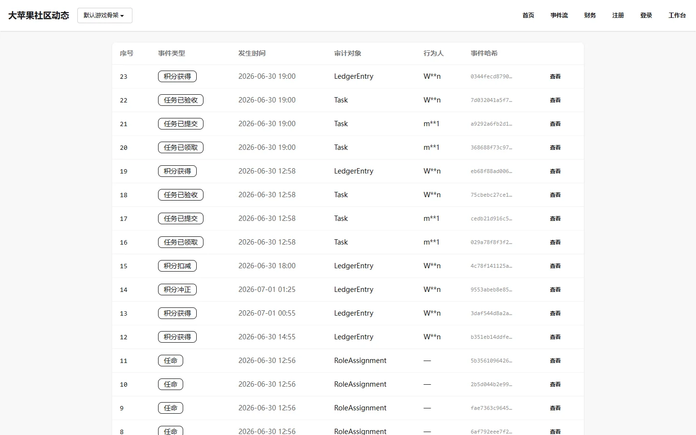

# 审计账本列表

## 页面用途

展示所有公开的审计事件记录。每个事件包含事件类型、发生时间、审计对象、行为人和事件哈希，提供对社区治理动作的完整追溯能力。

## 访问方式

- **URL**：`/event-ledger/`
- **权限**：公开，无需登录
- **位置**：Observer 公开观察台 → 审计账本

## 页面截图

## 页面组成

- **数据表格**：
  - 序号
  - 事件类型标签（如 SIMULATION_DAY、TASK 等）
  - 发生时间
  - 审计对象
  - 行为人
  - 事件哈希（截短显示）
  - 查看详情链接
- **空状态提示**：当没有公开审计事件时显示提示信息

## 主要功能

- 浏览所有公开的治理审计事件
- 按事件类型快速识别事件性质
- 通过事件哈希追溯数据的防篡改证明
- 点击"查看"进入详情页查看完整信息和哈希链校验

## 数据与权限

- 数据来自公开审计事件（LedgerEntry + SystemEvent）
- 只读访问，无需登录
- 数据通过 `seed_demo` 命令生成
- 每条记录均包含 SHA-256 哈希链（payload_hash / prev_hash / event_hash）

## 当前状态与限制

- 已实现，功能完整
- 数据依赖 `seed_demo` 生成的账本条目
- 账本数据为演示数据
- 哈希链校验需进入详情页执行

## 相关文档

- [运行制度](../../governance-instruments/index.md)
- [Observer 产品说明](../../product/observer.md)
- 账本事件详情页（路径 `/event-ledger/<seq>/`，动态序号，归属本说明书）
