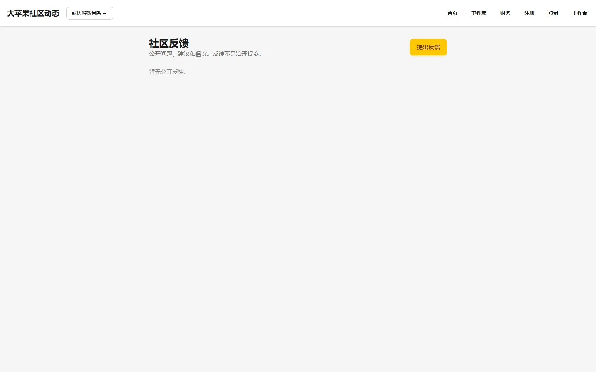

# 反馈列表

## 页面用途

展示社区成员提交的公开反馈和建议。每条反馈包含标题、分类、状态和提交时间，支持按状态筛选，是社区参与产品改进的公开渠道。

## 访问方式

- **URL**：`/feedback/`
- **权限**：公开，无需登录
- **位置**：公共站点 → 反馈

## 页面截图

## 页面组成

- **反馈列表**：每条反馈卡片包含：
  - 标题
  - 分类标签（feature_request / bug_report / suggestion / other）
  - 状态标签（pending / closed 等）
  - 提交时间
  - 提交者信息
- **提交反馈入口**：指向新建反馈页（需登录）
- **空状态提示**：当没有公开反馈时显示提示信息

## 主要功能

- 浏览所有公开反馈
- 点击进入详情页查看完整内容和回应
- 已登录用户可提交新反馈
- 隐藏的反馈仅治理成员可见

## 数据与权限

- 列表页：公开只读，隐藏的反馈自动过滤
- 详情页：公开反馈所有人可见，隐藏的仅治理成员可见
- 新建反馈：需要登录
- 回应反馈：需要治理成员权限
- 数据为真实用户提交内容

## 当前状态与限制

- 已实现，功能完整
- 列表为公开页面，但新建和回应操作需要登录或治理权限
- 反馈数据依赖真实用户提交，演示环境可能为空
- 隐藏反馈在各列表中均不可见（治理成员除外）

## 相关文档

- [参与建设指南](../../project/product-planning.md)
