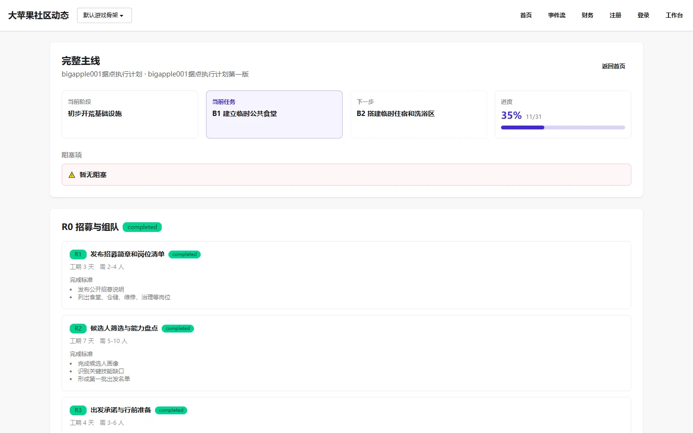

# 完整主线

## 页面用途

以树形时间线展示大苹果项目的完整执行计划，包括当前阶段、各阶段的任务分解、进度条、阻塞项，以及每个子节点的详细信息（工期、人数、完成标准、风险备注）。

## 访问方式

- **URL**：`/dashboard/mainline/`
- **权限**：公开，无需登录
- **位置**：Observer 公开观察台 → 完整主线

## 页面截图

## 页面组成

- **计划头部**：plan_title、revision_title
- **进度概览**：
  - 当前阶段标记
  - 当前任务和下一步
  - 百分比进度条
- **阻塞项列表**：当前被阻塞的任务及原因
- **阶段分组**：每个阶段显示其下的子节点，每个节点包含：
  - 节点编码（code）
  - 标题
  - 状态标签
  - 工期和所需人数
  - 完成标准
  - 风险备注

## 主要功能

- 纵览项目整体执行进度
- 了解当前阶段、当前任务和下一步计划
- 查看各阶段的详细任务分解
- 识别阻塞项和风险点

## 数据与权限

- 数据来自项目计划（PlanRevision + PlanNode）
- 只读访问，无需登录
- 数据通过 `seed_demo` 命令生成演示数据
- 当前为演示状态，计划内容不代表实际执行

## 当前状态与限制

- 已实现，功能完整
- 数据依赖 `seed_demo` 生成的计划数据
- 当前为演示数据，不是真实项目计划
- 进度百分比和阶段划分属于演示展示

## 相关文档

- [建设计划](../../project/roadmap.md)
- [Observer 产品说明](../../product/observer.md)
