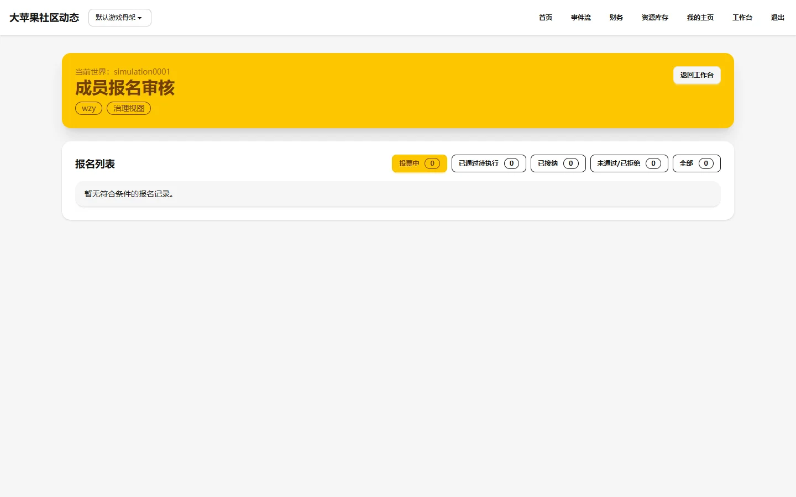

# 成员报名审核

## 页面用途

治理成员审核社区成员报名的管理页面，支持按准入进度状态筛选报名记录，查看每份报名的详细信息。

## 访问方式

- **URL**：`/workspace/applications/`
- **权限**：需要登录并拥有治理成员权限（通过完成登录认证并通过治理权限校验）
- **位置**：工作台 → 成员报名审核

## 页面截图

## 页面组成

- **页头**：显示"成员报名审核"标题和"治理视图"标记
- **状态筛选**：按准入进度筛选——投票中、已通过待接纳、已接纳、已拒绝、全部
- **报名列表表格**：包含申请 ID、报名者、意向角色、提交时间、当前状态
- **详情入口**：每条记录提供"查看"链接进入详情页

## 主要功能

- 按状态筛选报名记录
- 查看每份报名的审核详情
- 跟踪准入提案的治理流程

## 数据与权限

- 数据来自成员报名记录（MemberApplication），关联准入提案（Proposal）
- 仅治理成员可访问
- 只读查看，审核操作需要进入详情页
- 截图由维护者预先配置的本地测试账号访问生成

## 当前状态与限制

- 已实现，功能完整
- 默认筛选条件为 `voting`（投票中）
- 本地测试环境中可能没有报名记录，表格将显示空列表
- 空列表时页面结构和筛选功能仍然正常展示

## 相关文档

- [成员工作区产品说明](../../product/member-workspace.md)
- [运行制度](../../governance-instruments/index.md)
- [页面说明书清单](../../development/page-guide-inventory.md)
