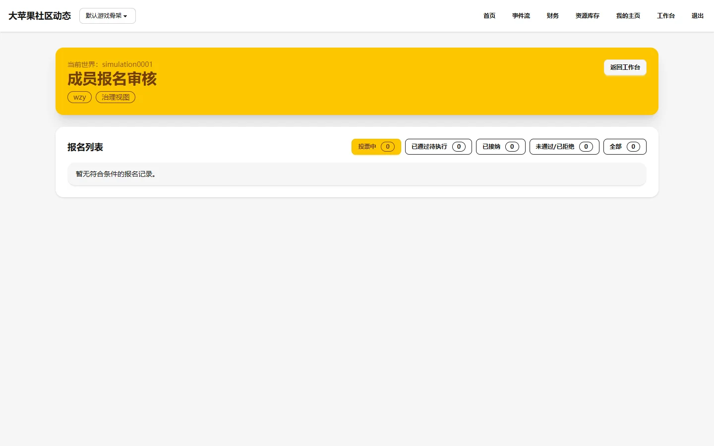

# 成员报名处理

## 页面用途

管理员处理社区成员报名的维护页面，支持按准入进度状态筛选报名记录，查看每份报名的详细信息。

## 访问方式

- **URL**：`/workspace/applications/`
- **权限**：需要登录并拥有维护权限（通过完成登录认证并通过维护权限校验）
- **位置**：工作台 → 成员报名处理

## 页面截图

## 页面组成

- **页头**：显示“成员报名处理”标题和“维护视图”标记
- **状态筛选**：按报名状态筛选——待迁移决策、已接纳、未通过/已拒绝、全部
- **报名列表表格**：包含申请 ID、报名者、意向角色、提交时间、当前状态
- **详情入口**：每条记录提供"查看"链接进入详情页

## 主要功能

- 按状态筛选报名记录
- 查看每份报名的处理详情
- 查看统一提案迁移期间的准入关闭状态

## 数据与权限

- 数据只来自成员报名记录（`MemberApplication`），不关联或创建旧准入提案
- 仅管理员可访问
- 列表和详情均为只读；投票、批准、拒绝和执行操作暂不可用
- 截图由管理员预先配置的本地测试账号访问生成

## 当前状态与限制

- 报名资料查看已实现；准入决策因统一提案流程迁移而失败关闭
- 默认筛选条件为 `pending`（待迁移决策）
- 本地测试环境中可能没有报名记录，表格将显示空列表
- 空列表时页面结构和筛选功能仍然正常展示

## 相关文档

- [成员工作区产品说明](../../product/member-workspace.md)
- [运行制度](../../governance-instruments/index.md)
- [页面说明书清单](../../development/page-guide-inventory.md)
