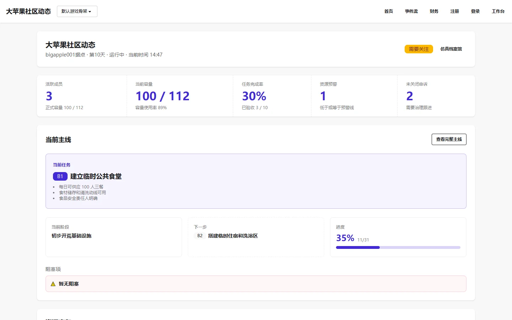

# Observer 仪表盘

Observer 仪表盘是大苹果社区面向所有访客的公开首页，位于站点根路径 `/`。

它不要求登录，任何访问者都可以直接查看社区的实时运行状态。

## 页面结构

页面采用时间线指挥台式布局，三栏结构：

- **左侧导航**——总览、事件、任务、资源、成员、岗位、争议、事件流、数据日志。默认折叠为图标按钮，点击展开。
- **中间主区域**——核心指标面板和"今日事件时间线（实时指挥）"，展示社区当前正在发生的事情。
- **右侧风险栏**——风险总览、容量评估、高负载岗位 TOP 3、待处理争议。

## 页面回答的问题

首页优先回答：

- 社区现在是否稳定。
- 今天最严重的事件是什么。
- 当前容量还能不能继续接纳成员。
- 哪些岗位压力最高。
- 哪些争议还没处理。

## 二级入口

从仪表盘可以进入以下只读页面：

- `/events/`——公开事件列表
- `/finance/`——公开财务
- `/feedback/`——公开反馈
- `/simulations/`——公开仿真档案馆

观察台不提供进入 `/admin/` 的导航，所有运营操作归属后台。

## 相关文档

- [Observer 模块说明](../../product/observer.md)
- [公开事件列表](../observer-events/index.md)
- [公开财务](../observer-finance/index.md)
