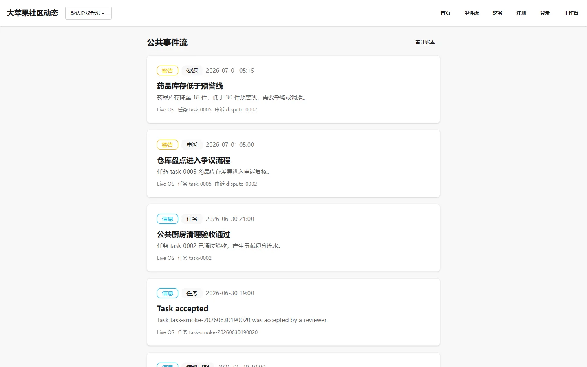

# 公开事件列表

公开事件列表（`/events/`）是面向所有访客的社区事件流，按时间顺序展示社区当前正在发生的事情。

事件数据来自 Live OS 的公开事件表，不包含隐私信息。

## 展示方式

- 列表页 `/events/` 展示最近 100 条公开事件或事项。
- 每条显示标题、摘要、事件类型、严重程度、发生时间和来源。
- 同一成员报名的多个阶段（submitted / admitted / rejected）聚合成一条事项卡片，普通事件每个对应一个详情页。

## 事件类型

公开事件类型包括：

- 成员报名与接纳
- 任务创建与完成
- 财务报销与付款
- 资源变更
- 争议提交与裁决
- 治理投票与提案

## 数据来源

事件数据来自 `core_event` 公开表。涉及治理和财务的关键事件同时写入 `core_system_event` 哈希审计链，可在详情页验证完整性。

## 相关文档

- [Observer 模块说明](../../product/observer.md)
- [Observer 仪表盘](../observer-dashboard/index.md)
