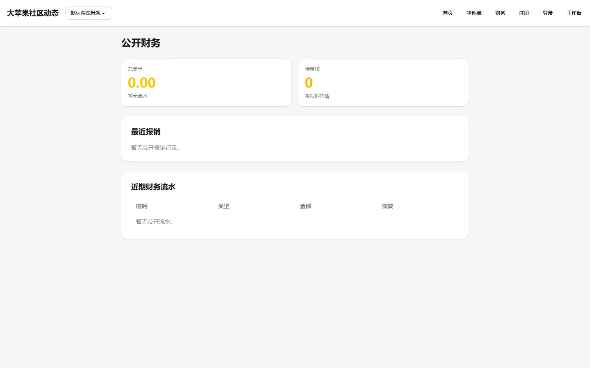

# 公开财务

公开财务页面（`/finance/`）向所有访客展示大苹果社区的财务流水，无需登录即可查看。

它的目的是回答"项目的钱花在哪里、由谁申请、由谁审核、是否付款"。

## 展示内容

- **报销事项**——已提交、已审核、已付款的报销记录，包含标题、金额、币种、类别、状态。
- **财务流水**——已记录的财务交易。

公开页不展示联系方式、账号、内部 ID 或私密凭证，只显示申请人和审核人的公开名称。

## 财务角色

- `finance.review`——审核报销。
- `finance.pay`——记录付款。
- 申请人不能自审或自付。

## 数据来源

页面直接读取 Live OS 权威表 `core_ledger_entry` 和报销相关数据。财务操作记录同时写入公开事件流和哈希审计链。

## 相关文档

- [Observer 模块说明](../../product/observer.md)
- [Observer 仪表盘](../observer-dashboard/index.md)
