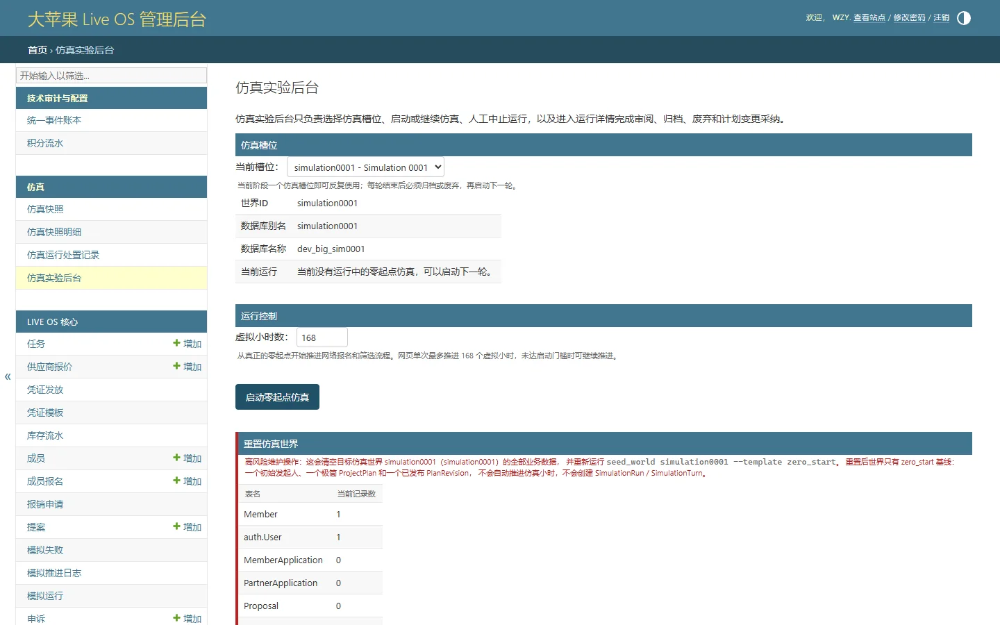

# 仿真实验后台

## 页面用途

Simulation Lab 的控制中心，用于启动和管理仿真推演运行，是项目的"沙盒测试场"。

## 访问方式

- **URL**：`/admin/simulation-lab/`
- **权限**：需要完成登录认证并通过 superuser 权限校验（Django admin 登录 + `is_superuser` 检查）
- **位置**：Django Admin → 仿真实验后台

## 页面截图

## 页面组成

- **面包屑导航**：首页 → 仿真实验后台
- **仿真槽位**：选择目标仿真世界
- **运行控制**：虚拟小时数输入、启动零起点仿真、继续当前仿真、中止当前仿真
- **待处置仿真运行**：列出需要操作的运行记录
- **重置仿真世界**：包含确认输入和重置按钮

## 主要功能

- 选择仿真世界并启动推演
- 控制推演的虚拟时间跨度
- 中止正在运行的推演
- 重置仿真世界数据
- 查看待处置的运行记录

## 数据与权限

- 需要 Django superuser 权限
- 所有操作均通过 admin 路由，受 `superuser_admin_view` 包装保护
- 数据来自仿真世界数据库
- 截图由维护者预先配置的本地测试账号访问生成

## 当前状态与限制

- 已实现，功能完整
- 需要预先使用管理命令初始化仿真世界
- 操作均为破坏性（如重置世界），使用需谨慎
- 截图中的具体世界 ID 和运行状态取决于本地测试环境数据

## 相关文档

- [Simulation Lab 产品说明](../../product/simulation.md)
- [仿真命令使用说明](../../development/simulation-commands.md)
- [页面说明书清单](../../development/page-guide-inventory.md)
