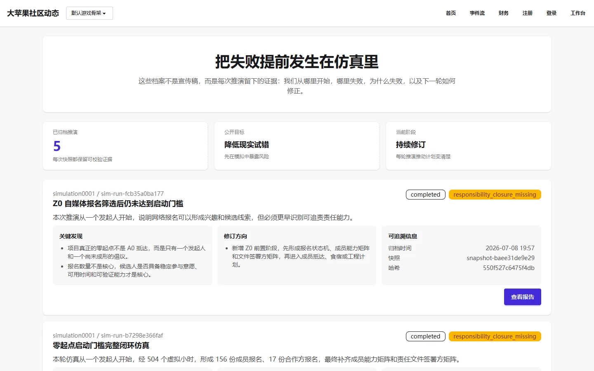

# 仿真报告列表

## 页面用途

展示所有已归档的公开仿真推演报告。每次通过 Simulation Lab 完成的推演运行，在归档后可在此页面公开查阅，供社区成员了解历史推演的结果、发现和经验。

## 访问方式

- **URL**：`/simulations/`
- **权限**：公开，无需登录
- **位置**：Observer 公开观察台 → 仿真档案馆

## 页面截图

## 页面组成

- **标语区**：展示"把失败提前发生在仿真里"的核心理念
- **统计数据**：已归档推演总数
- **报告卡片列表**：每张卡片包含：
  - 报告标题（headline）
  - 所属 world_id 和 run_id
  - 推演结论（conclusion）
  - 关键发现列表
  - 修订方向建议
  - 归档时间、快照 ID 和哈希值
- **空状态提示**：当没有公开仿真档案时显示提示信息

## 主要功能

- 浏览所有已归档的公开仿真报告
- 点击报告卡片进入详情页，查看完整推演过程
- 查看每个推演的关键发现和修订建议

## 数据与权限

- 数据来自公开仿真报告（`visibility=PUBLIC`）
- 只读访问，无需登录
- 报告由 Simulation Lab 操作员归档生成
- 每次报告均包含 SHA-256 哈希，可验证数据完整性

## 当前状态与限制

- 已实现，功能完整
- 数据完全依赖已归档的公开仿真报告
- 当前演示环境可能存在 0 条报告的情况（取决于是否执行过推演并归档）
- 报告内容为仿真生成数据，不是真实世界记录

## 相关文档

- [Simulation Lab 产品说明](../../product/simulation.md)
- [Observer 产品说明](../../product/observer.md)
- 仿真报告详情页（路径 `/simulations/<snapshot_id>/`，动态 ID，归属本说明书）
