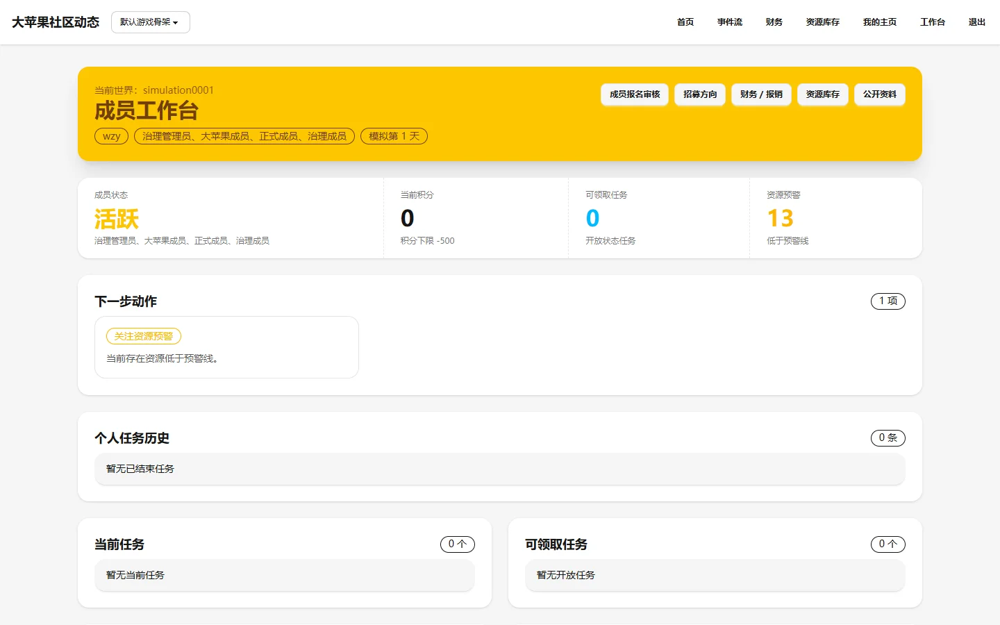

# 成员工作台

## 页面用途

守约者的个人工作空间，用于查看个人状态、认领任务、管理报销和参与社区事务。

## 访问方式

- **URL**：`/workspace/`
- **权限**：需要登录并绑定守约者身份
- **位置**：登录后自动进入

未登录用户访问会看到引导注册/登录的门禁页；已登录但非守约者（如报名中）会看到报名工作台。

## 页面截图

## 页面组成

- **页头**：显示"成员工作台"标题和当前成员编号
- **我的事务**：位于旧有首页模块之前，按“需要我处理”“等待他人”“最近结束”聚合现有领域事项；聚合是只读展示，不替代领域模型或权限规则
- **统计区**：成员状态、当前积分、可用积分、历史贡献、可领取任务数、资源预警
- **快捷入口**：
  - 积分转账（守约者）
  - 兑换订单（守约者）
  - 创建任务（仅典守者可见）
  - 任务验收（仅典守者可见）
  - 积分预算（仅典守者可见）
  - 成员报名处理（仅典守者可见）
  - 招募方向（仅典守者可见）
  - 财务 / 报销
  - 库存管理（仅典守者可见）
  - 兑换履约（仅典守者可见）
  - 商户结算（典守者或现金结算商户经营者可见）
- **下一步动作**：推荐的当前操作
- **个人任务历史**：已完成任务的表格记录
- **当前任务**：正在进行的任务列表
- **可领取任务**：社区中可认领的开放任务
- **迁移期旧模块**：上述原有模块、表单和入口全部保留并下移，后续由产品负责人逐项确认后再删除或迁移

## 主要功能

- 查看个人身份和统计信息
- 积分转账与兑换订单
- 认领开放任务
- 提交工时记录
- 管理个人报销
- 典守者可创建/发布任务、验收任务、管理积分预算、处理报名、管理招募方向、库存和兑换履约

## 数据与权限

- 数据来自当前成员的绑定世界数据库
- 页面根据成员角色动态显示不同功能入口
- 典守者可见额外的维护入口
- 守约者可访问完整工作台，非守约者只能看到报名工作台

## 当前状态与限制

- 已实现，功能完整
- 截图由典守者预先配置的本地测试账号访问生成
- 任务列表和统计依赖 seed 数据
- 不同成员看到的内容因角色和数据而异
- 当前新旧区域可能重复展示同一事项，这是便于逐项验收的迁移期行为

## 相关文档

- [成员工作区产品说明](../../product/member-workspace.md)
- [页面说明书清单](../../development/page-guide-inventory.md)
